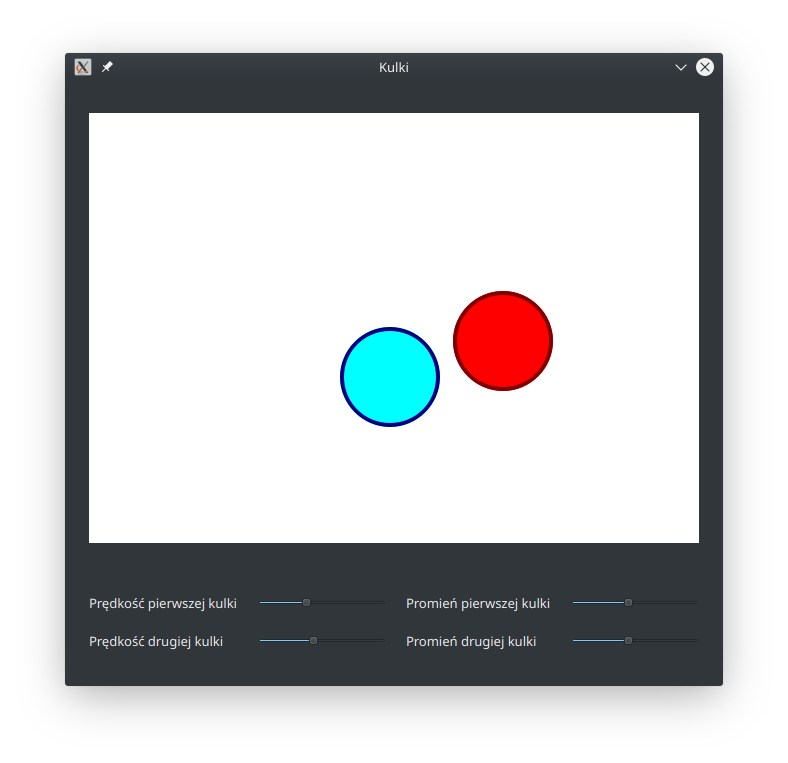

# Balls
Implementation of the given task. Application visualizes collision of two balls with possibility of
changing speed and radius of balls.

## Building
Program is written with C++14 standard, tested with Qt 5.11.2 version.
Minimal CMake supported version is 3.10.

## Implementation details
All ball parameters (speed, position, radius, colors) are contained in BallParameters class,
serving as an application model.

Ball display is implemented in Ball class, used in BallWidget class, displaying whole window

BallAnimator is a class responsible for animating ball moves and handling collisions

### Collision
Collisions are handled with vector operations. In case of wall collisions, sign of speed components is inverted.
Ball collisions are handled as two-dimensional collisions. In case of collision, collision angle is calculated,
and then speed vector is projected to new coordinate system (rotated by collision angle).
In this coordinate system, calculations are done like in one-dimensional collision, and then speeds are converted back
to original coordinate system.

### Changing speed/radius
Changing radius or speed may cause, that after collision detection and making move, collision will still be occuring.
For that case, BallAnimator checks if collision was already handled. Without this check, balls may glue to each other
or to the wall.
